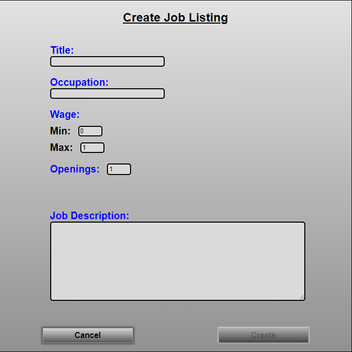

# Flask React Project

<br />
<div id="readme-top" align="center">
  <a href="https://github.com/NRH-AA/EmployMe">
    
  </a>

<h3 align="center">EmployMe</h3>
  <a href="https://employme.onrender.com">Link To EmployMe Live</a>
  <p align="center">
    EmployMe is a custom website designed to allow job seekers to create detailed resumes
    with a clean layout. Company owners can create job listings and company pages. EmployMe
    helps job seekers and company owners find the best possible matches.
    <br />
    <a href="https://github.com/NRH-AA/EmployMe/wiki"><strong>Explore the docs »</strong></a>
    <br />
    <br />
    <a href="https://github.com/NRH-AA/EmployMe/issues">Report Bug</a>
    ·
    <a href="https://github.com/NRH-AA/EmployMe/issues">Request Feature</a>
  </p>
</div>


<details>
  <summary>Table of Contents</summary>
  <ol>
    <li>
      <a href="#about-the-project">About The Project</a>
    </li>
    <li>
      <a href="#running-the-server-locally">Getting Started</a>
    </li>
    <li><a href="#examples-of-site-functionality">Examples</a></li>
    <li><a href="#features-in-development">Features In Development</a></li>
    <li><a href="#contributing">Contributing</a></li>
    <li><a href="#contact">Contact</a></li>
  </ol>
</details>


## About The Project
'EmployMe was designed to help job seekers and company owners 
find the best possible matches.'

<p align="right">(<a href="#readme-top">back to top</a>)</p>

### Built With


<p align="right">(<a href="#readme-top">back to top</a>)</p>


## Running the server locally
### 1. Clone the main branch of this repository.


### 2. Install dependencies
```bash
pipenv install -r requirements.txt
cd react-app
npm i
```


### 3. Create a **.env** file based on the .env.example file with proper settings for your development environment.
In order to use the file upload services you will have to create a S3 Bucket on AWS (Amazon Web Services)
```
SECRET_KEY=ARandomString
DATABASE_URL=sqlite:///dev.db
SCHEMA=flask_schema
S3_BUCKET=BucketName
S3_KEY=BucketKey
S3_SECRET=BucketSecretKey
```


### 4. Create, migrate, and seed the database.
```bash
  "pipenv run flask db init && pipenv run flask db migrate && pipenv run flask db upgrade && pipenv run flask seed all"
  
  If you are in the pipenv shell
  "flask db init && flask db migrate && flask db upgrade && flask seed all"
```


### 5. Run the server locally
Open two terminals one in / and one in /react-app
```bash
/: "pipenv run flask run"  OR "flask run" (if you are in the shell)
/react-app: "npm start"
```

<p align="right">(<a href="#readme-top">back to top</a>)</p>

To run the React App in development, checkout the [README](./react-app/README.md) inside the `react-app` directory.


## Examples of site functionality


Create your account with secure hashed password protection.


The home page displays recent posts from EmployMe users. You can scroll to the bottom of the page to load more posts.


You can set up your profile and create posts to create your best resume.



You can create job listings so job seekers can contact you.


<p align="right">(<a href="#readme-top">back to top</a>)</p>


## Features in development
- [ ] Albums for images
- [ ] Recommendations
- [ ] Company Profile Page
- [ ] Feedback/Reviews
- [ ] Messages/Inbox


See the [open issues](https://github.com/NRH-AA/EmployMe/issues) for a full list of proposed features (and known issues).

<p align="right">(<a href="#readme-top">back to top</a>)</p>


## Contributing

Contributions are what make the open source community such an amazing place to learn, inspire, and create. Any contributions you make are **greatly appreciated**.

If you have a suggestion that would make this better, please fork the repo and create a pull request. You can also simply open an issue with the tag "enhancement".
Don't forget to give the project a star! Thanks again!

1. Fork the Project
2. Create your Feature Branch (`git checkout -b feature/AmazingFeature`)
3. Commit your Changes (`git commit -m 'Add some AmazingFeature'`)
4. Push to the Branch (`git push origin feature/AmazingFeature`)
5. Open a Pull Request

<p align="right">(<a href="#readme-top">back to top</a>)</p>


## Contact
<pre>
Nathan Heinz - yta06291995@gmail.com
</pre>
Project Link: [https://github.com/NRH-AA/EmployMe](https://github.com/NRH-AA/EmployMe)

<p align="right">(<a href="#readme-top">back to top</a>)</p>

[React.js]: https://img.shields.io/badge/React-20232A?style=for-the-badge&logo=react&logoColor=61DAFB
[React-url]: https://reactjs.org/
